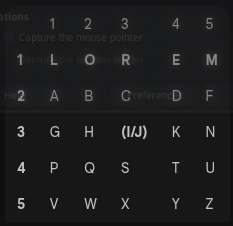

# Hanuš Valenta šifry úkol
Atbaš, Caesarova sifra s heslem, polybiuv ctverec s heslem, cardanova mřížka, morseova abeceda, vigenerova sifra a transpoziční šifra.

---

# Text pro ukázku
Lorem ipsum dolor sit amet consectetur adipiscing elit.
Heslo: Lorem

---

# Atbaš
Vyměníme každé písmeno korespondujícím písmenem od konce abecedy

---

Lorem ipsum dolor sit amet consectetur adipiscing elit.
|
V
Olimr rhkvn wlori hrg zng xlmhvxgvgvi zwkrhrxrmt vorf.

---

# Caesarova sifra s heslem
Vytvoříme abecedu pro šifrování skládající se z hesla a zbývalích písmen bez duplikátů

v tomto případě:
L O R E M A B C D F G H I J K N P Q S T U V W X Y Z

následně použijeme klasickou cézarovu šifru

---

Ukázka mapování pomocí cézarovy šifry
A B	C D	E F	G H	I J	K L	M
|
V
L O R E M A B C D F G H I

---

Výsledek:
Lorem ipsum dolor sit amet consectetur adipiscing elit.
|
V
H K Q M I D N S U I E K H K Q S D T L I M T R K J S M R T M T U Q L E D N D S R D J B M H D T.

---

# polybiuv ctverec s heslem
Čtverec 5x5 se začne vyplňovat písmeny hesla (L,O,R,E,M) bez duplicit.

---

Výsledek:
Lorem ipsum dolor sit amet consectetur adipiscing elit.
|
V
11 12 13 14 15 33 41 43 45 15 24 12 11 12 13 43 33 44 21 15 14 44 13 12 15 43 14 13 44 14 44 45 13 21 24 33 41 33 43 13 33 34 14 11 33 44

---

# cardanova mřížka
Cardanova mřížka je typ transpoziční šifry, která využívá mřížku s otvory.

1. Zpráva se píše do otvorů v mřížce.
2. Mřížka se otočí o 90 stupňů a pokračuje se v psaní.
3. Toto se opakuje pro 180 a 270 stupňů.
4. Výsledný text je zdánlivě náhodná mřížka písmen. Pro dešifrování je potřeba stejná mřížka.

---

# morseova abeceda
Každé písmeno a číslice je reprezentováno unikátní sekvencí teček a čárek.

---

Výsledek:
Lorem ipsum dolor sit amet consectetur adipiscing elit.
|
V
.-.. --- .-. . -- / .. .--. ... ..- -- / -.. --- .-.. --- .-. / ... .. - / .- -- . - / -.-. --- -. ... . -.-. - . - ..- .-. / .- -.. .. .--. .. ... -.-. .. -. --. / . .-.. .. -

---

# vigenerova sifra
Vigenerova šifra je metoda šifrování textu pomocí klíčového slova.

Použijeme tabulku, kde každá řádka odpovídá Caesarově šifře posunuté o jedno písmeno.

Pro šifrování se písmeno zprávy najde v horním řádku a písmeno z hesla v prvním sloupci. Písmeno v průsečíku je šifrovaný znak.

---
Okázka tabulky
|
V
LOREMIPSUMLOREMIPSUMLOREMIPSUMLOREMIPSUMLOREMIPSUMLOREMIPSUMLOREM

---

Výsledek:
Lorem ipsum dolor sit amet consectetur adipiscing elit.
|
V
Wkluz afzcy pswsv zfe ozal rcbzitrgtgv eqevfzwbuys zpef.

---

# transpoziční šifra
Transpoziční šifra mění pozici písmen v původním textu podle daného hesla.

1. Písmena hesla "LOREM" se očíslují podle abecedního pořadí: L(2) O(4) R(5) E(1) M(3).
2. Text se zapíše do mřížky o šířce délky hesla.
3. Sloupce se přečtou v pořadí daném očíslovaným heslem.

---

Zápis do mřížky:

| E(1) | L(2) | M(3) | O(4) | R(5) |
|---|---|---|---|---|
| L | o | r | e | m |
| i | p | s | u | m |
| d | o | l | o | r |
| s | i | t | a | m |
| e | t | c | o | n |
| s | e | c | t | e |
| t | u | r | a | d |
| i | p | i | s | c |
| i | n | g | e | l |
| i | t | . | | |

---

Výsledek:
Lorem ipsum dolor sit amet consectetur adipiscing elit.
|
V
Lidseti iiope tuit. rsltcrig. euoatoase. mmrmnectdcl